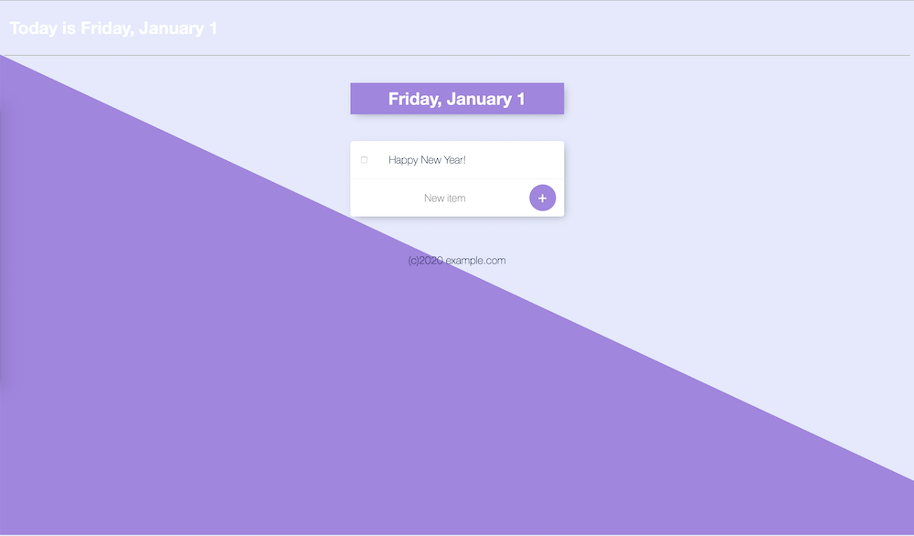

# About

A simple Node.js demo app running inside a Docker container.

> Note:
>
> This repository is link to Docker Hub and the image is automatically build after `git push`

Run the command `docker container run -p 80:3000 --name todoapp choonsiong/todoapp`, then open your browser and navigate to the url `http://localhost`

```
 22:49:38 364  docker container run -p 80:3000 --name todoapp choonsiong/todoapp
Unable to find image 'choonsiong/todoapp:latest' locally
latest: Pulling from choonsiong/todoapp
0a6724ff3fcd: Already exists 
f59e82757acf: Pull complete 
2b54ac9d1042: Pull complete 
cb081fe40633: Pull complete 
79a979dcac77: Pull complete 
8ed8cf9ba0cb: Pull complete 
7da63ee1db3e: Pull complete 
379dc98594d2: Pull complete 
635f7f6095ac: Pull complete 
ceb115ca53fc: Pull complete 
cb5464b65d56: Pull complete 
e1e8b2dce75a: Pull complete 
200e28845a7b: Pull complete 
71221b4d4138: Pull complete 
35c5a1d601e3: Pull complete 
121633255b40: Pull complete 
Digest: sha256:e65415a1983cc5d737870eda337b643d749e8bba475e868166c8cbc206d87bf6
Status: Downloaded newer image for choonsiong/todoapp:latest
Server started on port 3000
```

